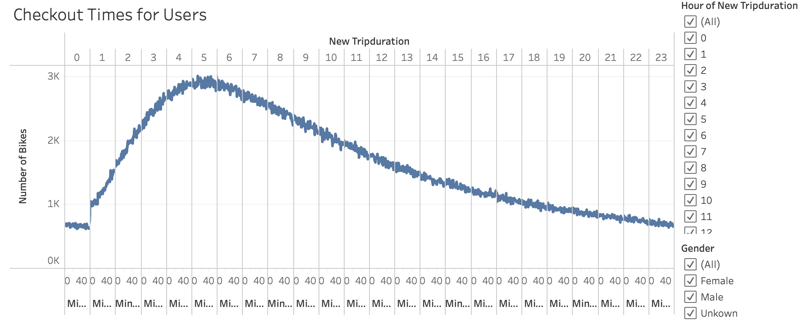

# bikesharing

## Purpose
This anaylsis was performed in order to vizualize key data from a New York Citi Bike dataset to present a business proposal to a bike sharing company. Tableau was used for the analysis of the data, and to prepare worksheets, dashboards, and stories highlighting the Key Data that is important for the business proposal. 

### Link to Tableau Story
[NYC CitiBike](https://public.tableau.com/shared/W2RJFP2JX?:display_count=n&:origin=viz_share_link "Tableau Story")

## Analysis
August 2019 CitiBike data was used for this analysis. The results of the Key Data findings are below.

#### 1. Checkout Times for Users

When tracking when users checked out bikes, we can see that during Hour 5, checkouts peaked at 3,005 users.

#### 2. Checkout Times by Gender

When tracking which genders were checking out the Citi Bikes at which times, we can see that male usage was significantly higher, and peaked during Hour 5. 

#### 3. Usertypes (Customers vs. Subscribers)

We were able to look at the breakdown between customers and subscribers, which was then broken down further by gender. It was determined that Citi Bike subscribers use the bikes the most on Thursdays, while customers had the heaviest usage on Saturdays.

#### 4. Trips (Weekday per Hour)

When tracking the heaviest usage periods, it was determined that between 5-6pm on weekdays drives the most traffic to the bikes. 

#### 5. Bike Usage per Hour

Because the bikes are so heavily used during the weekdays, and during rush hour commutes, it was also pertinent to track which hours they were used the least to check for potential maintenance windows. Between 2am to 5am seem to be the least used hours, which could be utilized for maintenance.

#### 6. Trips by Gender (Weekday per Hour)

Males predominantly use the Citi Bikes during peak hours, followed by females, and then by users of an unknown gender. 

#### 7. Gender Breakdown

Over 1.5 million males used Citi Bikes as a form of transportation during August 2019. 

## Summary 
- Males predominantly use the Citibikes during peak hours.
- The heaviest usage of the Citibikes occurs during rush hour on the weekdays, 8am and 5-7pm.
- There is a significant target market that can be centered around males that use the Citibikes to commute to work. 

### For Further Consideration 
As this data was centered around New York, a city well known for public transportation, additional data insights need to be gathered before pursuing a bike sharing company in Des Moines, Iowa. Additional insights for the business proposal include:

#### 1. Weather
- This analysis was done only on August 2019, in winter are users still cycling to work? 
- Are there certain months that the Citibikes aren't being used at all because of weather?
#### 2. Streets & Traffic Patterns
- Is the city bicycle friendly for users to be able to commute to work in Des Moines versus NYC?

